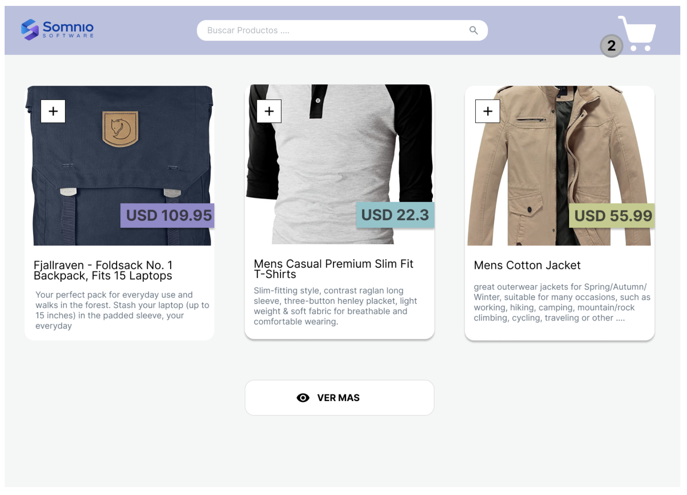
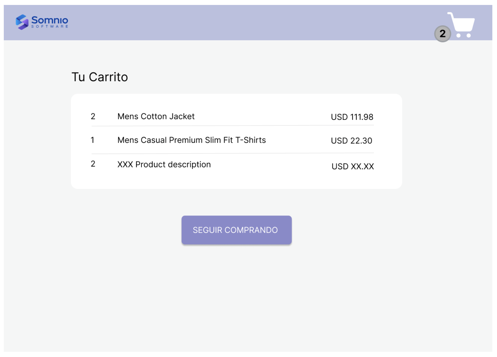

## Somnio React Challenge

This is a challenge about a small e-commerce with features such as:

- Local filtering by product name
- Cart persistence throughout the entire app
- Local pagination

## Designs / Mockups




### Setup

Run this command

```js
npm i
```

### Run the server

Run this command

```js
npm run dev
```

Open [http://localhost:3000/](http://localhost:3000/) in the browser

### Considerations

- Design was mimic as close as possible
- A new screen called `Checkout` was added to expand the user flow
- Some modifications about CTAs has been made to improve user flow and user experience

### Next Steps

- Add unit tests
- Create a custom hook for pagination
- Rearrange design tokens and abstract them with Sass tools
